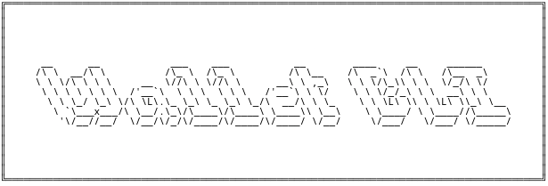

[](https://classroom.github.com/a/hy8NMZUz)

# Wallet CLI



### Prerequisites

To run this project, you'll need an environnement to run bash. If you use Linux or mac os, you can directly run the project.

If you use window, you can use (WSL)[https://learn.microsoft.com/fr-fr/windows/wsl/install] or open the project on (virtual machine)[https://www.virtualbox.org/]

### Installation

These are the steps to do to run this project after you have installed NodeJS

1. Clone the repo :

```sh
    git clone https://github.com/hei-school/my-wallet-AmourRamanantsiresy.git
```

2. Navigate to the current directory and open it

```sh
    cd my-wallet-AmourRamanantsiresy
```

3. Checkout to the feature/bash branch

```sh
    git checkout feature/bash
```

4. Give permission to the project

```sh
    chmod -R +x bash/*.sh
```

5. Go to the project

```sh
    cd bash
```

6. Run the project

```sh
    ./index.sh
```
